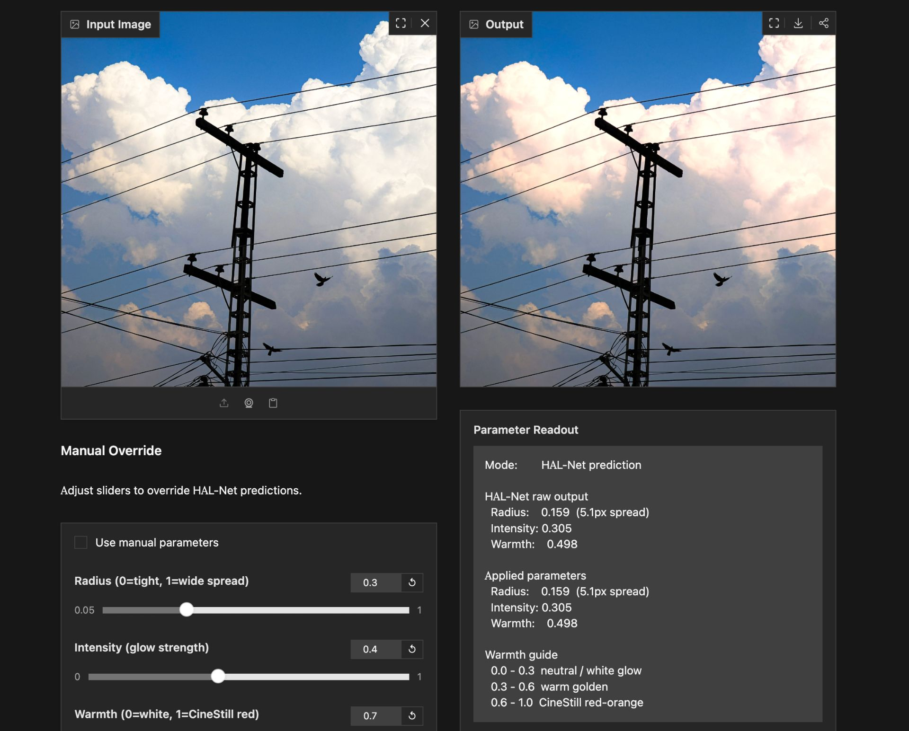

# HAL-Net

A lightweight CNN that estimates analog film halation parameters from
highlight regions and synthesizes a matching warm glow.

Trained on 100 handpicked CineStill 800T film scans from Flickr and
Lomography. Inspired by FGA-NN (Ameur et al., arXiv 2506.14350, 2025),
which models film grain but does not address halation.

## What it does

Upload any image. HAL-Net analyzes the highlight regions, estimates
three parameters (radius, intensity, warmth), and synthesizes a halation
effect matching what those parameters would produce on real film.
Manual override sliders let you adjust the predicted parameters and see
the result in real time.

## Parameters

- Radius: how far the glow spreads from the highlight edge (maps to a
  Gaussian sigma of 0-32px)
- Intensity: strength of the glow relative to the surrounding area
- Warmth: color bias from neutral white (0.0) to CineStill red-orange (1.0)

## Evaluation

Per-parameter MAE on the 15-image held-out test split:

| Method             | Radius | Intensity | Warmth | Mean  |
|--------------------|--------|-----------|--------|-------|
| Mean-pred baseline | 0.012  | 0.317     | 0.328  | 0.219 |
| Ridge regression   | 0.019  | 0.251     | 0.125  | 0.132 |
| HAL-Net            | 0.022  | 0.223     | 0.218  | 0.154 |

HAL-Net beats both baselines on intensity, the parameter most tied to
how strong the glow looks. On warmth, a ridge regression baseline on
13 handcrafted color statistics beats the CNN by a wide margin (0.125
vs 0.218). Radius is near-constant across the dataset so neither
learned method improves meaningfully on predicting the mean.

The paper reports this without selecting for favorable comparisons.
Full analysis including Grad-CAM attention maps in the repo.

## What is halation

Halation is the red-orange glow around bright light sources in analog
film. It occurs when light passes through the emulsion, reflects off
the film base, and re-exposes the silver halide crystals from behind.
CineStill 800T is the most well-known example: its anti-halation
backing was removed during processing for cinema use, making the
effect visible and distinctive.

## Dataset

100 CineStill 800T scans from Flickr and Lomography, selected for
visible halation around practical light sources (street lamps, neon
signs, candles, windows). Split 70/15/15 train/val/test.

## Architecture

3 strided conv layers (32, 64, 128 channels) + 2 residual blocks +
adaptive average pool + 2-layer regression head with Sigmoid output.
~200k parameters. Trains in under 5 minutes on a T4 GPU.

## Paper

Full write-up with method, evaluation, and Grad-CAM analysis in
HAL-Net_research_paper_v2.pdf in this repo.

## Based on

FGA-NN: Film Grain Analysis Using Neural Networks
Ameur et al., arXiv 2506.14350, 2025
https://arxiv.org/abs/2506.14350

## Live demo

https://huggingface.co/spaces/ahadstfu/hal-net
